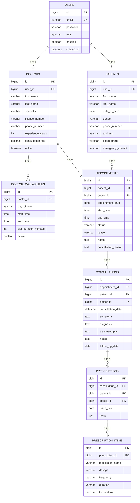

# Smart Medical Practice Management & Patient Engagement System

A production-style healthcare practice management web application engineered for modern clinical workflows, intelligent appointment scheduling, electronic medical records (SOAP notes), and patient engagement.

---

## Table of Contents
1. [Project Overview](#project-overview)
2. [Key Features by Role](#key-features-by-role)
3. [Architecture & Design](#architecture--design)
4. [Technology Stack](#technology-stack)
5. [Database Schema & ERD](#database-schema--erd)
6. [Security & Authentication (JWT + RBAC)](#security--authentication-jwt--rbac)
7. [Smart Appointment Scheduling & Availability Algorithm](#smart-appointment-scheduling--availability-algorithm)
8. [REST API Documentation](#rest-api-documentation)
9. [Getting Started & Setup](#getting-started--setup)
10. [Demo Credentials](#demo-credentials)
11. [Running Automated Tests](#running-automated-tests)
12. [ModMed Technical Interview Defense Guide](#modmed-technical-interview-defense-guide)

---

## 1. Project Overview

**Smart Medical Practice Management & Patient Engagement System** is a unified full-stack solution tailored for ambulatory medical practices, outpatient clinics, and specialty healthcare providers.

The platform streamlines clinical practice management by:
- Enabling patients to discover board-certified physicians, explore real-time appointment availability, book 30-minute consultation slots, and review their longitudinal clinical history and prescriptions.
- Providing physicians with an interactive clinical workstation to manage daily appointments, record structured SOAP consultation notes, issue e-prescriptions, and leverage an AI-assisted longitudinal patient history summarizer.
- Empowering practice administrators to supervise clinician schedules, manage patient registries, monitor capacity, and track practice-wide KPIs.

---

## 2. Key Features by Role

### 👨‍⚕️ Doctor Features
- **Physician Dashboard**: Real-time overview of today's appointment queue, upcoming visits, assigned patient volume, and completed consultations count.
- **Clinical Encounter Workstation (SOAP Notes)**:
  - Subjective (Chief complaint & symptom onset)
  - Objective (Clinical examination & vitals)
  - Assessment (Formal diagnostic classification)
  - Plan (Therapeutic plan, directives, and follow-up date)
- **Electronic Prescriptions (e-Rx)**: Create multi-item prescriptions (medication, dosage, frequency, duration, instructions) seamlessly during consultation.
- **AI Patient History Summarizer**: Synthesizes previous consultation encounters into structured clinical summaries (Past Complaints, Diagnostic History, Previous Treatments, Follow-up Directives) for rapid review before seeing a patient.
- **Weekly Practice Schedule Management**: Configure recurring practice hours (e.g., Monday–Friday 09:00–17:00, 30-minute duration).

### 🧑‍💼 Patient Features
- **Patient Dashboard**: Next upcoming visit banner, active prescriptions preview, and recent clinical notes summary.
- **Specialist Directory**: Search and filter practicing physicians by specialty (Cardiology, Dermatology, Pediatrics, Orthopedics, etc.).
- **Interactive Time Slot Picker**: View only real-time available 30-minute slots for any selected date, with past and booked slots excluded automatically.
- **My Appointments**: Track scheduled visits and cancel bookings with automatic slot release.
- **Medical Records & Encounters**: Full access to completed SOAP notes, diagnostic assessments, and attending physician directives.
- **Prescription Log**: Review all active and past electronic prescriptions.
- **Demographics Profile**: Maintain personal info, address, blood group, and emergency contact details.

### 🛡️ Practice Administrator Features
- **Operations Dashboard**: Master practice KPIs, capacity metrics, today's appointment volume, and status distribution breakdown (`BOOKED`, `CONFIRMED`, `COMPLETED`, `CANCELLED`).
- **Doctor Directory Management**: Add physicians, assign licenses and specialties, set consultation fees, and activate/deactivate accounts.
- **Patient Registry**: Searchable practice directory across all registered patients.
- **Master Appointment Calendar**: Monitor practice-wide bookings, confirm pending requests, and manage cancellations.

---

## 3. Architecture & Design

The application follows a clean, decoupled **Layered Architecture** adhering to SOLID principles and separation of concerns.

```
+-------------------------------------------------------------------+
|                    Angular 17+ SPA (Frontend)                     |
|  [Reactive Forms] [Route Guards] [JWT Interceptor] [Services]     |
+---------------------------------+---------------------------------+
                                  | HTTP / JSON (Bearer JWT)
                                  v
+-------------------------------------------------------------------+
|                   Spring Boot 3.3.5 (Backend API)                 |
|                                                                   |
|  [Controller Layer]   - REST Endpoints & Request Validation       |
|          |                                                        |
|          v                                                        |
|  [Service Layer]      - Core Business Logic & Scheduling Engine   |
|          |                                                        |
|          v                                                        |
|  [Repository Layer]   - Spring Data JPA Data Access Interfaces    |
|          |                                                        |
|          v                                                        |
|  [Database Layer]     - Relational MySQL (InnoDB) / In-Memory H2  |
+-------------------------------------------------------------------+
```

---

## 4. Technology Stack

### Backend
- **Java 21**: Modern LTS release utilizing modern language features and type safety.
- **Spring Boot 3.3.5**: Enterprise Java framework for microservices and web APIs.
- **Spring Security 6 & JJWT 0.12.5**: Stateless authentication with HMAC-SHA256 signed JSON Web Tokens.
- **Spring Data JPA & Hibernate 6**: Object-Relational Mapping with connection pooling (HikariCP).
- **MySQL 8.0**: Relational database with foreign key constraints, indexes, and ACID transaction isolation.
- **H2 Database**: Fast in-memory database for rapid, isolated unit and integration testing.
- **SpringDoc OpenAPI 2.6.0**: Automated OpenAPI 3 / Swagger documentation UI.
- **Lombok**: Boilerplate reduction.
- **Maven**: Build and dependency management.

### Frontend
- **Angular 17.3+**: Modern standalone component architecture.
- **TypeScript 5.4**: Strict type checking.
- **Angular Router**: Lazy-loaded feature routes with functional `CanActivateFn` guards.
- **Reactive Forms**: Model-driven form validation.
- **Angular HTTP Client**: Functional interceptors (`jwtInterceptor`, `errorInterceptor`).
- **Modern CSS Design System**: Custom healthcare SaaS UI palette with responsive grid layouts.

---

## 5. Database Schema & ERD



---

## 6. Security & Authentication (JWT + RBAC)

1. **Authentication Flow**:
   - `POST /api/auth/login` validates credentials against MySQL database using `BCryptPasswordEncoder`.
   - On success, Spring Security generates a compact, cryptographically signed JWT token containing subject (`email`), `role`, and expiration timestamp.
   - The token is returned alongside user profile metadata (`userId`, `profileId`, `role`, `fullName`).
2. **Stateless Authorization**:
   - Angular `jwtInterceptor` attaches `Authorization: Bearer <token>` to all subsequent outgoing HTTP requests.
   - Spring Security `JwtAuthFilter` intercepts incoming requests, validates the signature and expiry, loads `UserPrincipal`, and populates the `SecurityContextHolder`.
3. **Role-Based Access Control (RBAC)**:
   - Method-level security enabled via `@EnableMethodSecurity` and `@PreAuthorize("hasRole('...')")`.
   - Frontend route protection enforced via `roleGuard(['ROLE_DOCTOR', 'ROLE_ADMIN'])`.

---

## 7. Smart Appointment Scheduling & Availability Algorithm

### Slot Calculation Logic (`AvailabilityService.calculateAvailableSlots`)
1. **Date Validation**: Immediate rejection of past dates (`targetDate < today`).
2. **Schedule Lookup**: Identifies the day of the week for `targetDate` and queries active `DoctorAvailability` for that doctor (`dayOfWeek = targetDate.dayOfWeek AND active = true`).
3. **Slot Slicing**: Generates discrete time intervals of length `slotDurationMinutes` (default: 30 minutes) from `startTime` to `endTime`.
   $$\text{Slot}_i = [T_{\text{start}} + i \cdot \Delta t, \ T_{\text{start}} + (i+1) \cdot \Delta t)$$
4. **Booking Conflict Exclusion**: Queries existing non-cancelled appointments for the doctor on that date (`status != 'CANCELLED'`). Any candidate slot overlapping with an active appointment interval is marked unavailable with reason `"Booked"`.
5. **Real-Time Past Slot Filtering**: If `targetDate == today`, slots whose start time is earlier than `LocalTime.now() + 5 minutes` are marked unavailable with reason `"Past time"`.

### Concurrency & Double-Booking Prevention (`AppointmentService.createAppointment`)
To ensure zero double-booking under concurrent user requests:
- **Application Level**: Booking execution occurs inside a synchronized, transactional method (`@Transactional(isolation = Isolation.READ_COMMITTED)`).
- **Validation Check**: Re-queries `findConflictingAppointments(doctorId, date, startTime, endTime)`. If any conflicting record is found, the transaction rolls back and aborts with an immediate `409 ConflictException`.
- **Database Level**: Foreign key constraints and composite indexes (`idx_doctor_date` on `(doctor_id, appointment_date)`) guarantee fast lookups and strict relational integrity.

---

## 8. REST API Documentation

Base URL: `http://localhost:8080/api`  
Interactive Swagger UI: `http://localhost:8080/api/swagger-ui.html`

| Method | Endpoint | Access | Description |
|---|---|---|---|
| `POST` | `/auth/login` | Public | Authenticate user & retrieve JWT token |
| `POST` | `/auth/register` | Public | Register new patient account |
| `GET` | `/doctors` | Public | List active doctors (filter by specialty) |
| `GET` | `/doctors/{id}` | Public | Get doctor profile details |
| `GET` | `/doctors/{id}/availability` | Public | Get doctor's weekly practice hours |
| `GET` | `/doctors/{id}/available-slots` | Public | Calculate real-time available 30-min slots for date |
| `POST` | `/doctors` | Admin | Create new doctor profile |
| `DELETE` | `/doctors/{id}` | Admin | Deactivate doctor profile |
| `GET` | `/patients/{id}` | Patient/Doctor/Admin | Get patient profile by ID |
| `PUT` | `/patients/{id}` | Patient/Admin | Update patient demographics |
| `POST` | `/appointments` | Patient/Admin | Book an appointment with double-booking prevention |
| `PATCH` | `/appointments/{id}/status` | Doctor/Admin | Update appointment status (CONFIRMED, COMPLETED) |
| `POST` | `/appointments/{id}/cancel` | Patient/Doctor/Admin | Cancel appointment & free up slot |
| `POST` | `/consultations` | Doctor/Admin | Create SOAP notes, prescription, & mark COMPLETED |
| `GET` | `/consultations/patient/{id}/summary` | Doctor/Admin | AI Clinical history summarizer for patient |
| `POST` | `/prescriptions` | Doctor/Admin | Issue electronic prescription |
| `GET` | `/dashboard/admin` | Admin | Aggregate practice-wide analytics & KPIs |
| `GET` | `/dashboard/doctor/{id}` | Doctor/Admin | Doctor today agenda & upcoming queue |
| `GET` | `/dashboard/patient/{id}` | Patient/Admin | Patient next appointment & active prescriptions |

---

## 9. Getting Started & Setup

### Prerequisites
- **Java 21 (JDK 21)**
- **Node.js 18+ or 20+ / 22+ & npm**
- **MySQL 8.0** (or Docker)

### Option A: Local Run (Standard)

#### 1. Backend Setup
```bash
cd backend
# Set JAVA_HOME if needed
./mvnw clean package -DskipTests
./mvnw spring-boot:run
```
*The Spring Boot backend will start on `http://localhost:8080/api` and automatically initialize the database with demo doctors, patients, schedules, and clinical records.*

#### 2. Frontend Setup
```bash
cd frontend
npm install
npm start
```
*The Angular application will be live at `http://localhost:4200`.*

---

### Option B: Docker Compose Setup

Run the entire platform (MySQL + Backend + Frontend) in one command:
```bash
docker-compose up --build
```
- Frontend: `http://localhost:4200`
- Backend API: `http://localhost:8080/api`
- Swagger UI: `http://localhost:8080/api/swagger-ui.html`

---

## 10. Demo Credentials

The system comes pre-seeded with realistic healthcare personas:

| Role | Email | Password | Description |
|---|---|---|---|
| **Admin** | `admin@medicare.com` | `Admin@123` | Practice operations manager |
| **Doctor** | `sarah.jenkins@medicare.com` | `Doctor@123` | Dr. Sarah Jenkins (Cardiology) |
| **Doctor** | `robert.miller@medicare.com` | `Doctor@123` | Dr. Robert Miller (Dermatology) |
| **Doctor** | `elena.rostova@medicare.com` | `Doctor@123` | Dr. Elena Rostova (Pediatrics) |
| **Doctor** | `james.wilson@medicare.com` | `Doctor@123` | Dr. James Wilson (Orthopedics) |
| **Patient** | `john.smith@gmail.com` | `Patient@123` | John Smith (Hypertension record) |
| **Patient** | `emily.davis@gmail.com` | `Patient@123` | Emily Davis (Rosacea record) |
| **Patient** | `michael.brown@gmail.com` | `Patient@123` | Michael Brown (Knee pain booking) |

---

## 11. Running Automated Tests

The backend includes comprehensive unit and integration tests verifying slot generation, concurrency, double-booking prevention, cancellations, and security authentication:

```bash
cd backend
./mvnw test
```

Test coverage highlights:
- `AppointmentServiceTest.testCalculateAvailableSlots_Success`: Verifies exact 30-minute interval generation across working hours.
- `AppointmentServiceTest.testDoubleBooking_ThrowsConflictException`: Simulates concurrent booking collision and verifies `ConflictException`.
- `AppointmentServiceTest.testCancelAppointment_FreesSlot`: Asserts that cancelled appointment slots are immediately restored as available.
- `AuthServiceTest`: Verifies BCrypt password hashing, duplicate email detection, and JWT claim issuance.
- `ConsultationServiceTest`: Verifies SOAP note capture and atomic appointment status transition to `COMPLETED`.

---

## 12. ModMed Technical Interview Defense Guide

Here are 8 curated technical questions and answers designed specifically for discussing this project in a Software Engineer interview at ModMed:

### Q1: How does your appointment availability algorithm work, and how do you prevent double-booking?
> **Answer**:  
> "The algorithm operates in two stages:  
> 1. **Availability Generation**: When a patient chooses a doctor and date, `AvailabilityService.calculateAvailableSlots()` queries the doctor's recurring weekly working hours (`DoctorAvailability`) for that specific day of the week. It slices the working window into discrete 30-minute intervals and performs an overlap check against all active (non-cancelled) appointments in the database. Slots that overlap or have already passed in local time are marked unavailable.  
> 2. **Double-Booking Prevention**: When creating an appointment, `AppointmentService.createAppointment()` runs within a transaction (`READ_COMMITTED` isolation) and synchronizes the critical check. It re-validates that no overlapping appointment exists in the range `[startTime, endTime)`. If a concurrent request booked the slot in the milliseconds between slot rendering and form submission, a `ConflictException` (HTTP 409) is thrown and the transaction rolls back."

### Q2: Why did you choose JPA/Hibernate entity relationships this way instead of a large monolithic table?
> **Answer**:  
> "We structured the database in 3rd Normal Form (3NF) to ensure data integrity and avoid duplication. For instance, separating `DoctorAvailability` from `Appointment` allows clinicians to define generic recurring working hours without creating millions of empty slot records in advance. Similarly, separating `Consultation` and `Prescription` ensures that clinical notes (SOAP records) remain distinct from medication items (`PrescriptionItem`), which have a 1-to-Many cardinality and need to be queried independently."

### Q3: How do you handle authentication and authorization in Spring Security 6?
> **Answer**:  
> "We implemented stateless JWT authentication. Passwords are encrypted using `BCryptPasswordEncoder` with a work factor of 10. Upon login, `JwtUtils` signs an HMAC-SHA256 token containing user claims (`sub`, `role`, `exp`). On every HTTP request, our custom `JwtAuthFilter` extracts the Bearer token, validates its cryptographic signature and expiration, builds a `UserPrincipal`, and registers it into the `SecurityContextHolder`. We then enforce Role-Based Access Control (RBAC) declaratively using `@PreAuthorize("hasRole('...')")` on backend endpoints and functional `roleGuard` in Angular."

### Q4: How is error handling centralized across the application?
> **Answer**:  
> "On the backend, we use a global `@RestControllerAdvice` (`GlobalExceptionHandler`) that intercepts custom domain exceptions like `ResourceNotFoundException` (404), `ConflictException` (409), `BadRequestException` (400), and `MethodArgumentNotValidException` (validation errors). It maps them into a consistent `ErrorResponse` payload with timestamps, HTTP status codes, and field validation maps. On the frontend, Angular's `errorInterceptor` intercepts HTTP errors and triggers non-blocking toast notifications via `ToastService`."

### Q5: How is the AI Patient History Summarizer designed to be reliable in production?
> **Answer**:  
> "In healthcare practice management, stability and speed are paramount. Rather than coupling the core application directly to an external LLM service that could fail or experience latency spikes during clinical encounters, our `AiSummarizerService` features a deterministic fallback parser that aggregates and formats longitudinal SOAP notes, past diagnoses, and treatments. It can seamlessly delegate to OpenAI's structured completion API when configured, but never causes clinical downtime if the API is offline."

### Q6: How does the Angular frontend manage state and prevent unauthorized route access?
> **Answer**:  
> "The frontend uses `AuthService` as a single source of truth backed by a `BehaviorSubject<AuthResponse>` for reactive state propagation to the `Navbar` and `Sidebar`. Route security is implemented via modern functional guards (`authGuard` and `roleGuard`). If a patient attempts to access `/admin/dashboard` or `/doctor/appointments`, `roleGuard` intercepts the activation and redirects the user to their appropriate role-specific landing page."

### Q7: Why use DTOs instead of exposing JPA Entity classes directly in Controllers?
> **Answer**:  
> "Exposing JPA entities directly creates severe architectural problems:  
> 1. **Security / Information Leakage**: Password hashes or internal IDs could accidentally be serialized into JSON responses.  
> 2. **Infinite Recursion / Lazy Initialization Errors**: Bidirectional relationships (e.g. `Doctor` $\leftrightarrow$ `Appointment`) cause JSON serialization loops or Jackson `LazyInitializationException`.  
> 3. **Decoupling**: DTOs decouple our API contract from our underlying database schema, allowing schema migrations without breaking frontend clients."

### Q8: If this system were to scale to 1,000 concurrent practices, what architectural enhancements would you make?
> **Answer**:  
> "1. **Multi-Tenancy**: Introduce a `tenant_id` column or separate schemas per medical practice.  
> 2. **Caching**: Use Redis to cache doctor availability schedules and specialties to reduce database query volume.  
> 3. **Distributed Locking / Database Optimization**: For extreme concurrency booking surges, utilize Redis distributed locks (Redisson) or database-level optimistic locking with `@Version` timestamps on availability slots.  
> 4. **Read/Write Replicas**: Direct dashboard reporting and search queries to read replicas while routing bookings to the primary writer."
